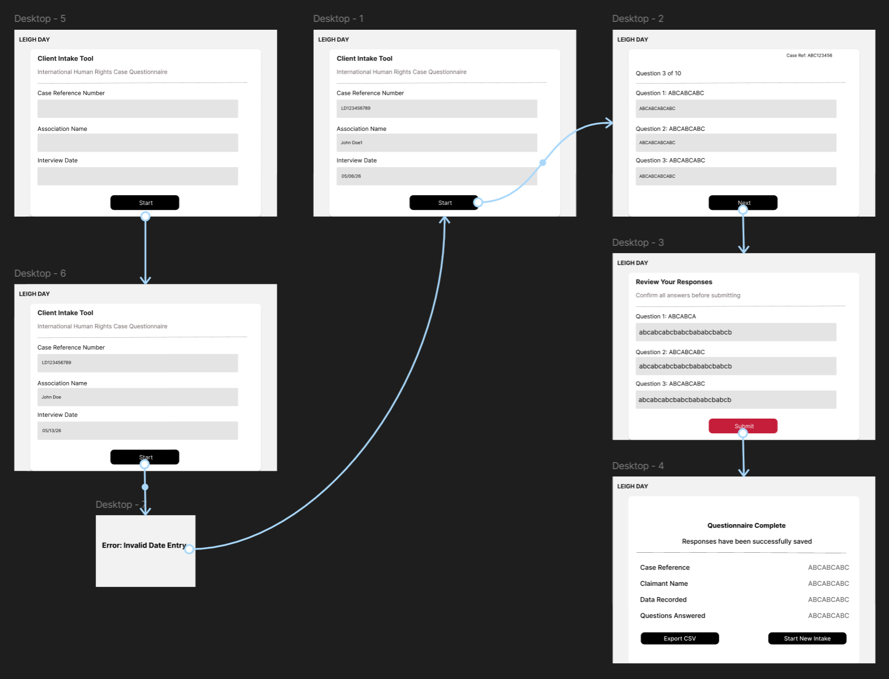
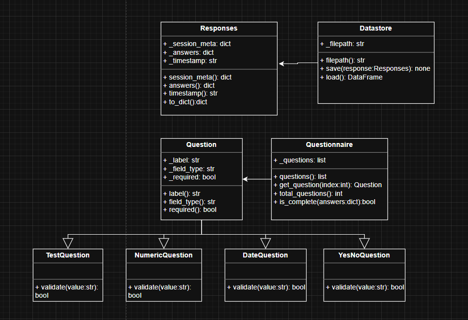
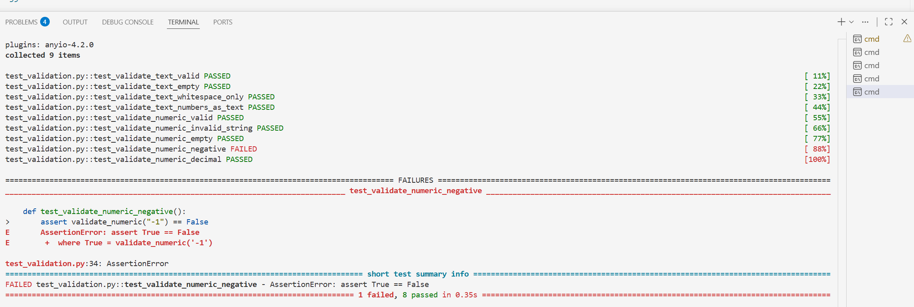
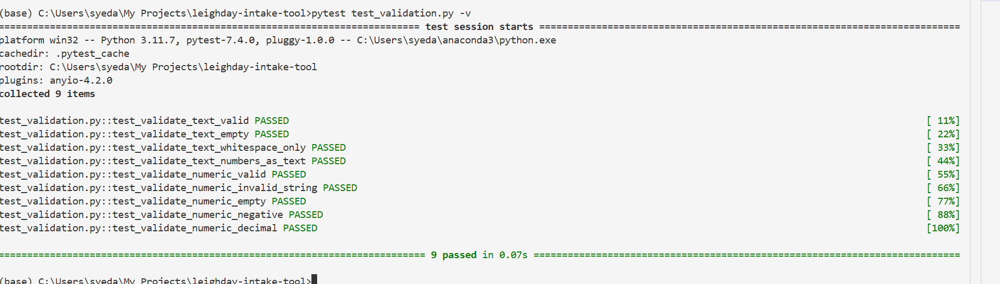
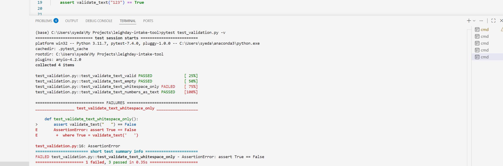
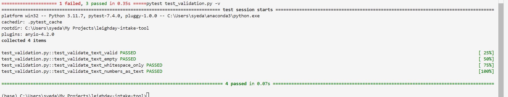
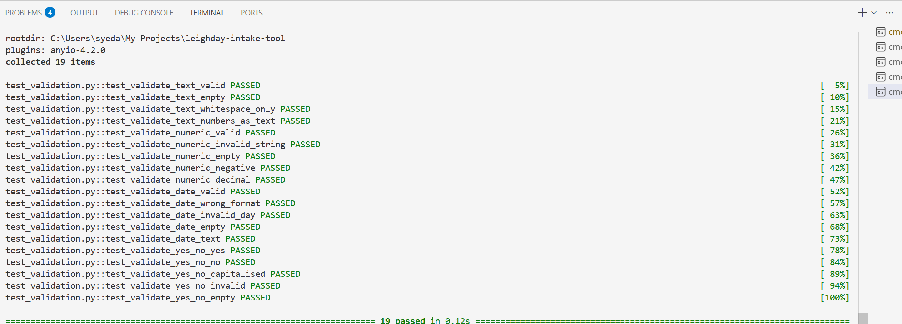

## Leigh Day Intake Tool

## Introduction
At Leigh Day we sepcialise in human rights, personal injury, and group litigation. I work as a Data Analyst within the firm, supporting the international human rights department. A significant part of this work involves large-scale group litigation cases where legal teams travel to regions across Africa, Asia, and South America to conduct field interviews with potential claimants.

Currently, lawyers conducting these eligibility interviews record claimant responses using Excel spreadsheets. While functional, this approach has several limitations. Excel is not optimised for structured data entry in field conditions, there is no built-in input validation, and the resulting files vary in format between interviewers, which creates significant cleaning work before the data can be uploaded into our database and or used analytically. Inconsistent formatting across submissions has caused delays in case preparation and increases the risk of data entry errors on sensitive legal records.

The Minimum Viable Product I have developed is a desktop application built using [Python](https://docs.python.org/3/) using [Streamlit](https://docs.streamlit.io/), designed to standardise and streamline the claimant intake process. The application guides a lawyer through a structured questionnaire for each claimant, combining open text, numeric, date, and yes/no question types. Validation is applied at the point of entry, where a response does not meet the expected format, an error message is displayed and progression to the next question is blocked. This ensures stored records are clean, consistent, and suitable for analytical review. This is particularly important in a legal context where inaccurate claimant data could affect case preparation and claimant eligibility assessments. A dedicated review screen acts as an additional safeguard, allowing the lawyer to check all responses before final submission.

Responses are saved to a [CSV file](https://docs.python.org/3/library/csv.html) that can be exported at the end of each session. CSV was chosen because it is lightweight, requires no database setup, and can be opened directly in [MS Excel](https://www.microsoft.com/en-gb/microsoft-365/excel) by legal staff who are already familiar with that format. Each session captures consistent column headers and data types regardless of which lawyer conducts the interview, meaning CSV files from multiple field trips can be merged and analysed without manual cleaning.

## Design

### GUI Design

**Figure 1:** Show the high-fidelity mockup that was produced in Figma prior to development. It reflect Leigh Day's black, white, and grey brand identity and was designed to show the intended user journey from entry of case details upon start of interview through to data export. The hi-fi mockup was used to plan the screen layout, validation points and navigate flow before implementation. It both represnets the final visual appearance of the application as well as structure, sequence and user interaction.



**Figure 1:** Hi-Fi mockup

### Functional Requirements

| # | Requirement |
|---|-------------|
| FR1 | The application must present a structured claimant intake questionnaire consisting of open text, numeric, date, and yes/no question types |
| FR2 | Each question must validate input against its expected format and display an inline error message if the entry does not meet the required rules |
| FR3 | Session metadata including case reference number, interviewing lawyer name, and interview date must be captured before the questionnaire begins |
| FR4 | Completed claimant responses must be appended to a persistent CSV file stored locally on the device |
| FR5 | The lawyer must be able to review all claimant responses on a summary screen before final submission |
| FR6 | On completion, the application must allow the lawyer to export the responses CSV file for use in case preparation |
| FR7 | The application must support starting a new claimant intake session without closing or restarting the application |

### Non-Functional Requirements

| # | Requirement |
|---|-------------|
| NFR1 | The application must run locally without an internet connection to support field use |
| NFR2 | The interface must be intuitive enough for non-technical legal staff to use without training |
| NFR3 | Input validation errors must be clearly communicated to the user at the point of entry |
| NFR4 | The CSV output must be consistently formatted across sessions regardless of interviewer |
| NFR5 | The application must be portable and runnable on Windows |

### Tech Stack Outline
- [Python 3](https://docs.python.org/3/) - core programming language
- [csv](https://docs.python.org/3/library/csv.html) - local data storage in CSV format
- [datetime](https://docs.python.org/3/library/datetime.html) - timestamp generation
- [Streamlit](https://docs.streamlit.io/) -To build interactive web app

### Code Design



## Development

The application is structured across multiple files, each with a single responsibility. Screen navigation is handled through Streamlit's session state, which persists data between reruns. The data model is built using object-oriented programming principles, with validation logic separated into pure functions to support independent testing.

### Project Structure

```
leigh-day-intake-tool/
├── app.py                  ← main entry point and screen routing
├── welcome_screen.py       ← screen 1
├── intake_screen.py        ← screen 2
├── review_screen.py        ← screen 3
├── complete_screen.py      ← screen 4
├── question.py             ← Question base class and subclasses
├── questionnaire.py        ← Questionnaire class
├── response.py             ← Response class
├── datastore.py            ← DataStore class
├── validation.py           ← pure validation functions
├── test_validation.py      ← pytest unit tests
└── assets/                 ← Figma design screenshots
```

### App Routing - app.py

`app.py` is the main entry point. It initialises session state and routes the user to the correct screen based on the value of `st.session_state.screen`. Each screen is imported as a function from its own file, keeping the routing logic clean and separate from the UI logic.Streamlit reruns the entire script on every user interaction. Session state is used to store data between these reruns storing the case reference, associate name, interview date and claimant answers so they survive navigation between screens.

```python
def main() -> None:

    init_state() #call memory

    #current user screen
    screen = st.session_state.screen

    #Check what screen user is on and route them accordingly
    if screen == "welcome":
        welcome_screen()
    elif screen == "intake":
        intake_screen()
    elif screen == "review":
        review_screen()
    elif screen == "complete":
        complete_screen()
    else:
        st.error(f'Unknown Screen: {st.session_state.screen}') #flag if some screen is wrong and just redirect to welcome
        st.session_state.screen = "welcome"
        st.rerun()
```

### OOP Design - question.py

The application uses inheritance and polymorphism to model different question types. A base Question class defines shared attributes - label, field type, and whether the question is required. Four subclasses inherit from it and each define their own validate() method with type-specific logic. This means the intake screen can call question.validate(value) on any question regardless of its type, and the correct validation logic runs automatically.

```python
class NumericQuestion(Question):
    """A question that expects a positive number response."""

    def __init__(self, label: str, required: bool = True) -> None:
        super().__init__(label, "numeric", required)

    def validate(self, value: str) -> bool:
        return validate_numeric(value)
```

### Pure Validation Functions - validation.py

Validation logic is separated into pure functions in `validation.py`. Each function takes a string and returns a boolean - they can be tested independently with pytest without needing to run the full application.

```python
def validate_numeric(value: str) -> bool:
    try:
        return float(value.strip()) > 0
    except ValueError:
        return False
```
### Response - responses.py
The Response class acts as a container for a single completed claimant session. It stores session metadata and claimant answers as separate private attributes, and automatically generates a timestamp on creation. The to_dict() method merges everything into one flat dictionary, which DataStore then writes as a single row in the CSV file.

```python
def to_dict(self) -> dict:
        """
        Convert the response to a flat dictionary for CSV export.Returns a flat dictionary combining metadata, answers and timestamp.
        """
        row = {}
        row["timestamp"] = self._timestamp
        row["case_ref"] = self._session_meta.get("case_ref", "")
        row["associate_name"] = self._session_meta.get("associate_name", "")
        row["interview_date"] = self._session_meta.get("interview_date", "")
        row.update(self._answers)
        return row
```

### Storage - datastore.py

The `DataStore` class handles reading from and writing to `responses.csv`. On first submission it creates the file with headers. Subsequent submissions append new rows without repeating the headers. On the completion screen the file is read back and passed to Streamlit's download button for export.

```python
def save(self, response: Response) -> None:
        """
        Save a Response to the CSV file.
        """
        try:
            row = response.to_dict()
            df_new = pd.DataFrame([row])

            if os.path.exists(self._filepath):
                df_new.to_csv(self._filepath, mode='a', header=False, index=False)
            else:
                df_new.to_csv(self._filepath, mode='w', header=True, index=False)

        except Exception as e:
            raise IOError(f"Failed to save response: {e}")
```
## Testing
Testing was approached at two levels. Unit tests were written using pytest to validate the pure functions in validation.py in isolation. A TDD approach was followed - initial test runs produced failures which were then used to identify and fix bugs in the validation logic. Manual testing was carried out to cover the full user journey and GUI behaviour, as these aspects cannot be tested through automated unit tests alone. Finally, integration testing confirmed the end-to-end flow from form submission through to CSV export worked as expected.


*Figure 2: validate_numeric test failing before fix*


*Figure 3: validate_numeric all tests passing after fix*


*Figure 4: validate_text test failing before fix*


*Figure 5: validate_text all tests passing after fix*


*Figure 6: Full test suite passing*

### Manual Test Results

| Test ID | Description | Input | Expected Result | Actual Result | Pass/Fail |
|---------|-------------|-------|-----------------|---------------|-----------|
| MT01 | App launches without errors | None | Welcome screen displayed | Welcome screen displayed | Pass |
| MT02 | Empty case reference blocked | Leave blank, click Begin | Error message shown | Error message shown | Pass |
| MT03 | Invalid date format blocked | Enter "11/23/24" | Error message shown | Error message shown | Pass |
| MT04 | Valid welcome form progresses | Valid inputs | Intake screen shown | Intake screen shown | Pass |
| MT05 | Empty question blocked | Leave blank, click Review | Error message shown | Error message shown | Pass |
| MT06 | Invalid numeric input blocked | Enter "abc" for years | Error message shown | Error message shown | Pass |
| MT07 | Invalid yes/no blocked | Enter "maybe" | Error message shown | Error message shown | Pass |
| MT08 | Valid intake form progresses | Valid answers | Review screen shown | Review screen shown | Pass |
| MT09 | Review screen shows answers | Complete intake | All answers displayed | All answers displayed | Pass |
| MT10 | Submit saves to CSV | Click Submit | CSV file created | CSV file created | Pass |
| MT11 | Export CSV downloads file | Click Export CSV | File downloads | File downloads | Pass |
| MT12 | New intake resets session | Click Start New Intake | Welcome screen, empty fields | Welcome screen, empty fields | Pass |

### User Documentation

The Leigh Day Claimant Intake Tool is designed to be used by legal staff during field interviews. No technical knowledge is required to operate the application.

**Starting the application**
Once the application has been launched, it will open in your web browser automatically. You will be presented with the welcome screen.

**Step 1 - Enter session details**
Enter the case reference number, your name as the interviewing associate, and the interview date in DD/MM/YYYY format. All three fields are required. If any field is left empty or the date is in the wrong format, an error message will appear and you will not be able to proceed.

**Step 2 - Complete the questionnaire**
You will be presented with a series of questions about the claimant. Each question has an expected format - some require a number, others a date, and some require yes or no. If your response does not meet the expected format an error message will appear below the field.

**Step 3 - Review your responses**
Once all questions are answered click Review Responses. You will see a summary of all your answers. Check these carefully before proceeding as this is your last opportunity to review the data.

**Step 4 - Submit and export**
Click Submit to save the responses. You will then see a confirmation screen. Click Export CSV to download the responses file. This file can be opened in Excel and shared with the data team.

**Starting a new session**
Click Start New Intake to reset the form and begin a new claimant interview.

### Technical Documentation

**Requirements**
- Python 3.11+
- pip

**Installation**

```bash
git clone https://github.com/SIslam-rgb/leighday-intake-tool
cd leighday-intake-tool
pip install streamlit pandas pytest
```

**Running the application**

```bash
streamlit run app.py
```

**Running the tests**

```bash
pytest test_validation.py -v
```

**Output**
Responses are saved to `responses.csv` in the project root directory.

